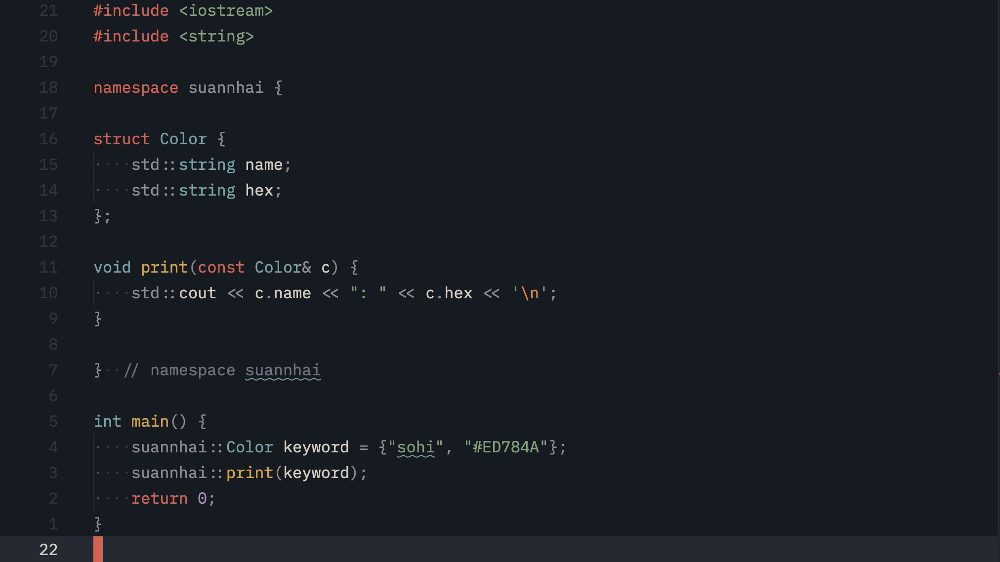
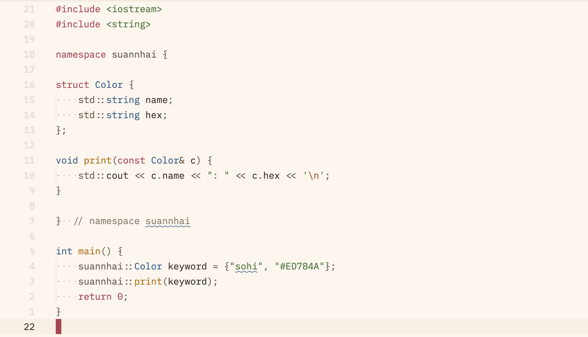
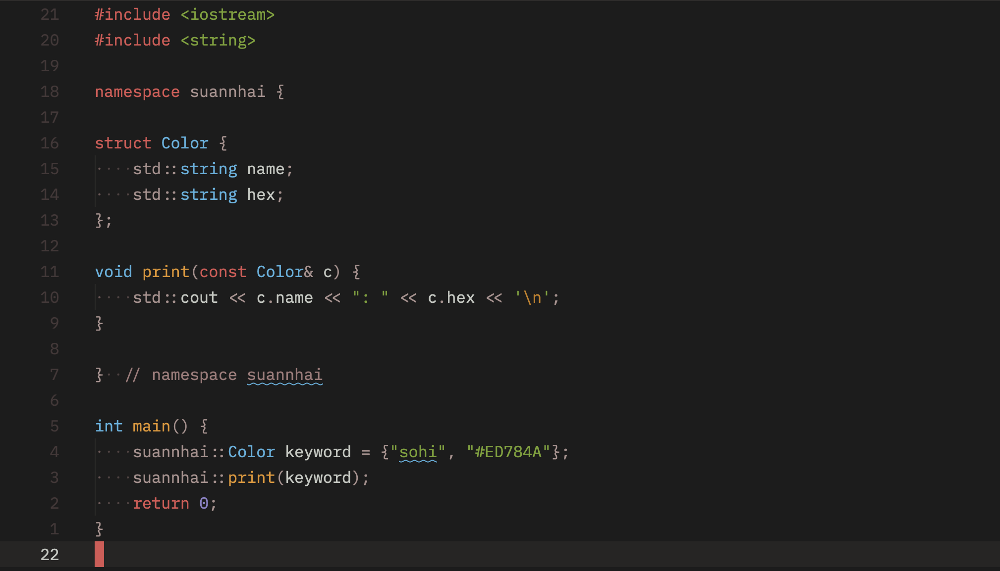
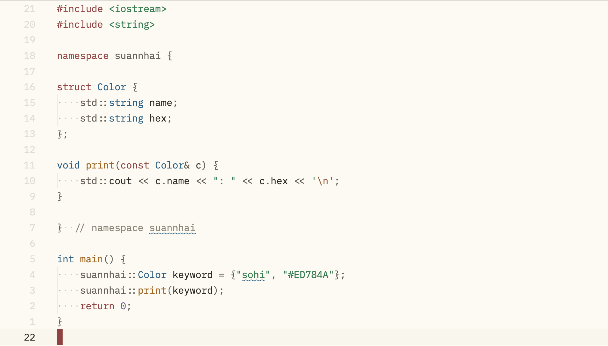
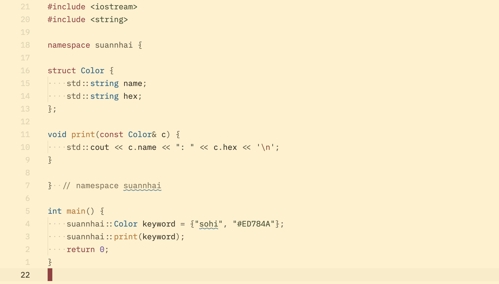

# Suannhai

Suann-hai (山海) means "mountain and sea" in Taiwanese, the two things that define the island. This project takes traditional colors from both Formosa and Nippon. The Formosa variants are named after places and crafts -- `Jiufen` lantern-lit stone steps, the indigo dye houses of `Lam-ni`, the printed cotton of `Hue-poo`. The Nippon variants are built entirely from colors documented at [nipponcolors.com](https://nipponcolors.com) 

## Variants

### Formosa

| Variant          | Appearance | Preview |
| ---------------- | ---------- | ------- |
| Suannhai Jiufen  | Dark       |  |
| Suannhai Lam-ni  | Dark       |  |
| Suannhai Hue-poo | Light      |  |

### Nippon

| Variant            | Appearance | Preview |
| ------------------ | ---------- | ------- |
| Suannhai Rouiro    | Dark       |  |
| Suannhai Sumi      | Dark       |  |
| Suannhai Koiai     | Dark       |  |
| Suannhai Torinoko  | Light      |  |
| Suannhai Shironeri | Light      |  |

## Supported

- [`Zed`](./suannhai-zed/)
- [`Neovim`](./suannhai-nvim/)
- [`WezTerm`](./suannhai-wezterm/)

## Contributing
Bug reports, feature requests, and pull requests are welcome.
